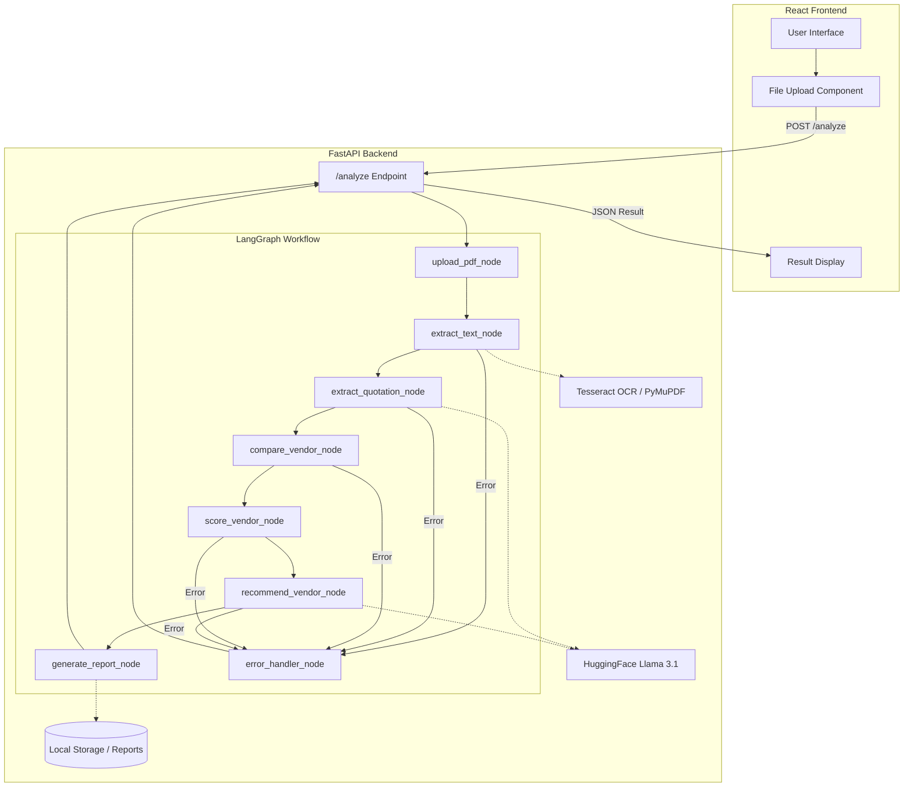

# AI Procurement Agent

## Overview

The AI Procurement Agent is a web-based application designed to automate and streamline the vendor quotation analysis process. It leverages a FastAPI backend, a LangGraph-powered AI workflow, and a React frontend to allow users to upload multiple PDF quotation documents, extract key information, compare vendors, score them based on predefined criteria, and generate a comprehensive procurement report.

### Key Features:
*   **PDF Upload & Text Extraction:** Upload multiple vendor quotation PDFs. The system automatically extracts text, with OCR fallback for scanned documents.
*   **AI-Powered Quotation Extraction:** Utilizes a Large Language Model (LLM) to parse and extract structured data (vendor details, item specifics, pricing, terms) from unstructured quotation text.
*   **Vendor Comparison:** Compares extracted data from multiple vendors, presenting a consolidated view.
*   **Vendor Scoring & Recommendation:** Scores vendors based on criteria like price, delivery time, warranty, and payment terms, and provides an AI-driven recommendation.
*   **Automated Report Generation:** Generates a detailed Excel report summarizing the comparison, scores, and recommendations.
*   **Interactive Frontend:** A user-friendly React interface for uploading files and viewing results.

## Architecture

The AI Procurement Agent follows a client-server architecture with a clear separation of concerns:

*   **Frontend:** A React application provides the user interface for file uploads and result display.
*   **Backend:** A FastAPI application serves as the API gateway, handling file uploads and orchestrating the AI workflow.
*   **AI Workflow:** Built with LangGraph, this component manages a multi-step process for PDF processing, data extraction, analysis, and report generation. It integrates with an LLM (HuggingFace Llama 3.1) for intelligent data extraction and recommendation, and uses OCR (Tesseract) for handling scanned PDFs.



## Setup and Installation

Follow these steps to set up and run the AI Procurement Agent locally.

### Prerequisites

*   Python 3.9+
*   Node.js 18+
*   `pip` (Python package installer)
*   `npm` or `yarn` (Node.js package manager)
*   `git`
*   **Tesseract OCR:** Required for extracting text from scanned PDFs. Install it according to your operating system:
    *   **Ubuntu/Debian:** `sudo apt update && sudo apt install tesseract-ocr`
    *   **macOS (Homebrew):** `brew install tesseract`
    *   **Windows:** Download from [Tesseract-OCR GitHub](https://tesseract-ocr.github.io/tessdoc/Installation.html)

### 1. Clone the Repository

```bash
git clone https://github.com/ChAtulKumarPrusty/AI_Procurement_Agent.git
cd AI_Procurement_Agent
```

### 2. Backend Setup

1.  **Create a Python Virtual Environment (Recommended):**
    ```bash
    python3 -m venv venv
    source venv/bin/activate  # On Windows: .\venv\Scripts\activate
    ```

2.  **Install Python Dependencies:**
    ```bash
    pip install -r requirements.txt
    ```

3.  **Configure Environment Variables:**
    Create a `.env` file in the root directory (`AI_Procurement_Agent/`) and add your Hugging Face API token:
    ```
    HUGGINGFACE_ACCESS_TOKEN="YOUR_HUGGINGFACE_API_TOKEN"
    ```
    You can obtain a Hugging Face API token from [Hugging Face Settings](https://huggingface.co/settings/tokens).

4.  **Run the Backend Server:**
    ```bash
    uvicorn app:app --reload --port 8080
    ```
    The backend API will be accessible at `http://localhost:8080`.

### 3. Frontend Setup

1.  **Navigate to the Frontend Directory:**
    ```bash
    cd procurement-frontend
    ```

2.  **Install Node.js Dependencies:**
    ```bash
    npm install
    # or yarn install
    ```

3.  **Run the Frontend Development Server:**
    ```bash
    npm run dev
    # or yarn dev
    ```
    The React application will typically open in your browser at `http://localhost:5173`.

## Usage

1.  Ensure both the backend (FastAPI) and frontend (React) servers are running.
2.  Open your web browser and navigate to `http://localhost:5173`.
3.  Use the file upload interface to select one or more PDF quotation documents.
4.  Click the 
upload button.
5.  The system will process the PDFs, extract information, compare vendors, score them, and generate a recommendation.
6.  The results, including comparison tables, vendor scores, and the final recommendation, will be displayed on the page. You can also download the generated Excel report.

## Error Handling

The system incorporates several error handling mechanisms:

*   **Frontend Validation:** Basic file type validation (PDF only) is performed client-side.
*   **Backend Validation:** The FastAPI endpoint validates file uploads, ensuring PDFs are provided and handling cases of no files uploaded.
*   **LangGraph Error Routing:** The LangGraph workflow includes an `error_handler_node` to catch and manage errors that occur during the processing pipeline (e.g., PDF parsing failures, LLM extraction issues).

### Potential Improvements for Error Handling:

*   **Granular Error Types:** Implement specific error codes and messages for different failure scenarios to provide more informative feedback to the user and aid debugging.
*   **Centralized Logging:** Integrate a robust logging system (e.g., Python's `logging` module) to capture detailed error information, including stack traces, for better monitoring and post-mortem analysis.
*   **Enhanced Frontend Feedback:** Improve the frontend to display specific error messages received from the backend, guiding users on how to resolve issues rather than generic "Upload Failed" alerts.
*   **Retry Mechanisms:** Consider adding retry logic with exponential backoff for transient errors, especially when interacting with external services like the LLM.
*   **Structured Error Objects:** Within the LangGraph state, store errors as structured objects (e.g., `{'code': 'ERROR_CODE', 'message': 'Description', 'node': 'failing_node'}`) for more programmatic handling.

## Development

### Project Structure

```
AI_Procurement_Agent/
├── app.py                  # FastAPI application entry point
├── model/                  # LLM configuration
│   └── llm.py
├── node_function/          # LangGraph nodes (individual processing steps)
│   ├── compare_vendor_node.py
│   ├── error_handler_node.py
│   ├── extract_quotation_node.py
│   ├── extract_text_node.py
│   ├── generate_report_node.py
│   ├── recommend_vendor_node.py
│   ├── score_vendor_node.py
│   └── upload_pdf_node.py
├── procurement-frontend/   # React frontend application
│   ├── public/
│   ├── src/
│   │   ├── api/
│   │   ├── assets/
│   │   └── components/     # React components (FileUpload, Result, etc.)
│   ├── package.json
│   └── ...
├── reports/                # Directory for generated Excel reports
├── requirements.txt        # Python dependencies
├── state/                  # LangGraph state definition
│   └── state.py
├── uploads/                # Directory for uploaded PDF files
├── workflow/               # LangGraph workflow definition
│   └── graph.py
└── .env.example            # Example environment variables
```

## Deployment Instructions

Deploying the AI Procurement Agent involves setting up both the backend FastAPI application and the frontend React application. This guide provides general steps; specific details might vary based on your chosen hosting provider (e.g., AWS, Google Cloud, Azure, Heroku, Vercel).

### 1. Backend Deployment

1.  **Containerization (Recommended):** Create a `Dockerfile` for your FastAPI application. This ensures a consistent environment across development and production.

    Example `Dockerfile` (in the root `AI_Procurement_Agent/` directory):
    ```dockerfile
    # Use an official Python runtime as a parent image
    FROM python:3.9-slim-buster

    # Set the working directory in the container
    WORKDIR /app

    # Install Tesseract OCR and its language data
    RUN apt-get update && apt-get install -y \ 
        tesseract-ocr \ 
        tesseract-ocr-eng \ 
        libgl1-mesa-glx \ 
        && rm -rf /var/lib/apt/lists/*

    # Copy the current working directory into the container at /app
    COPY . /app

    # Install any needed packages specified in requirements.txt
    RUN pip install --no-cache-dir -r requirements.txt

    # Make port 8080 available to the world outside this container
    EXPOSE 8080

    # Run uvicorn when the container launches
    CMD ["uvicorn", "app:app", "--host", "0.0.0.0", "--port", "8080"]
    ```

2.  **Build and Push Docker Image:**
    ```bash
    docker build -t ai-procurement-backend .
    docker tag ai-procurement-backend your-docker-registry/ai-procurement-backend:latest
    docker push your-docker-registry/ai-procurement-backend:latest
    ```

3.  **Provision Infrastructure:** Set up a virtual machine, a container orchestration service (e.g., Kubernetes, AWS ECS, Google Cloud Run), or a Platform-as-a-Service (PaaS) that supports Docker containers.

4.  **Environment Variables:** Configure `HUGGINGFACE_ACCESS_TOKEN` as an environment variable in your deployment environment. **Never hardcode sensitive information.**

5.  **Run the Container:** Deploy your Docker image. Ensure port `8080` is exposed and accessible.

### 2. Frontend Deployment

1.  **Build the React Application:**
    Navigate to the `procurement-frontend` directory and build the optimized production bundle:
    ```bash
    cd procurement-frontend
    npm run build
    # or yarn build
    ```
    This will create a `dist` directory containing the static assets.

2.  **Host Static Files:** The `dist` directory can be served by any static file hosting service (e.g., Netlify, Vercel, AWS S3 + CloudFront, Nginx).

3.  **Configure API Endpoint:** Ensure the frontend is configured to communicate with your deployed backend API. You might need to adjust the `baseURL` in `procurement-frontend/src/api/procurementApi.js` or use environment variables during the build process to point to your backend's public URL.

    *   **Example (using environment variable in Vite):**
        In `procurement-frontend/.env` (for development) or during build for production:
        ```
        VITE_API_BASE_URL=https://your-backend-api.com
        ```
        Then, in `procurementApi.js`:
        ```javascript
        const instance = axios.create({
            baseURL: import.meta.env.VITE_API_BASE_URL || 'http://localhost:8080',
        });
        ```

### 3. Cross-Origin Resource Sharing (CORS)

If your frontend and backend are hosted on different domains (which is typical in production), you will need to configure CORS on your FastAPI backend to allow requests from your frontend domain. Update the `allow_origins` list in `app.py`:

```python
app.add_middleware(
    CORSMiddleware,
    allow_origins=["http://localhost:5173", "https://your-frontend-domain.com"], # Add your frontend domain
    allow_credentials=True,
    allow_methods=["*"],
    allow_headers=["*"],
)
```

## Contributing

Contributions are welcome! Please feel free to submit a Pull Request or open an issue on the GitHub repository.

## License

This project is licensed under the MIT License - see the `LICENSE` file for details. (Note: A `LICENSE` file is not currently present in the repository and should be added.)

## Contact

For any questions or inquiries, please contact 
[Name - Ch Atul Kumar Prusty]
[Portfolio - atulprusty.vercel.app]
[GitHub Profile - https://github.com/ChAtulKumarPrusty/]
[Linkedin Profile - https://www.linkedin.com/in/chatulkumarprusty/]
